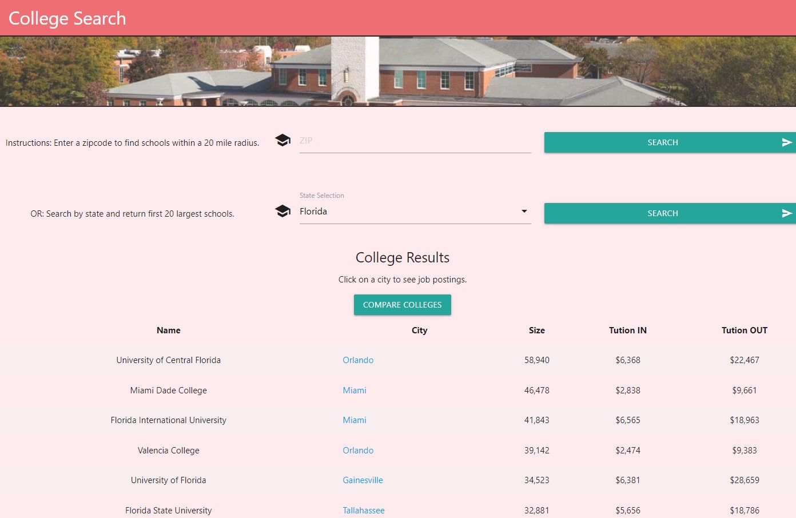

## College Search

## Purpose
College search provides the user with the ability to search for colleges by state or zipcode. This search provides information such as location and size. Users can look at available job postings by clicking on the area of a college. Users can also compare in depth statistics between two selectable colleges.

## Built With
* HTML
* CSS
* JAVASCRIPT
* MATERIALIZE
* ADZUNA API
* DEPARTMENT OF EDUCATION API

## Website
https://ryanweiler92.github.io/College-Search/index.html

## Contribution
Made By Ryan Weiler